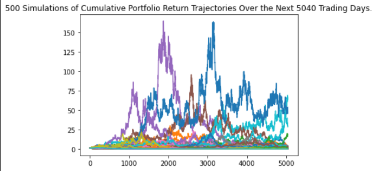
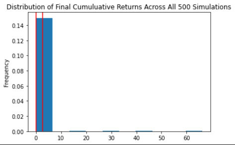
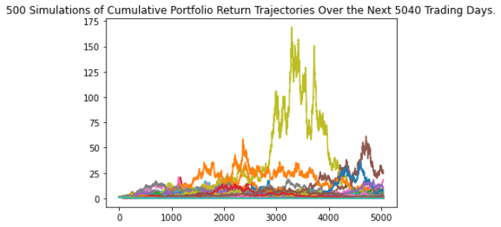
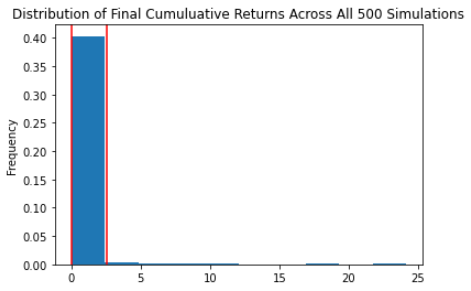
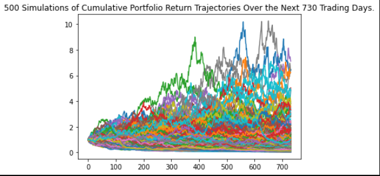
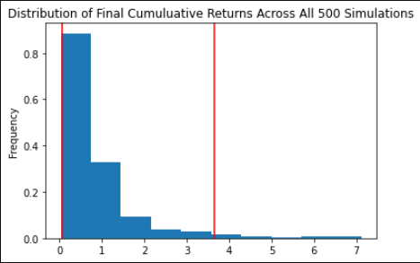
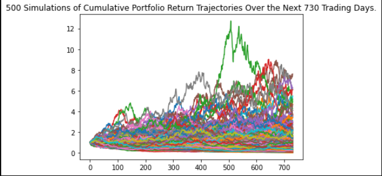
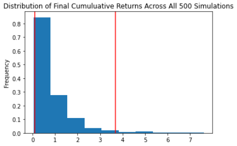
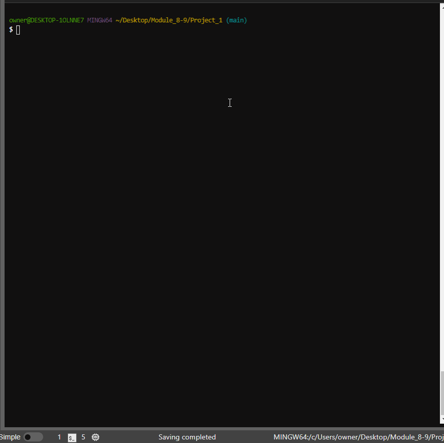

# Project 1: An Analysis of Cryptocurrency using Monte Carlo Simulation
UNCC Online FinTech Bootcamp Module 8-9 Project due by 11:59pm 1/30/2022

[Presentation Requirements](https://courses.bootcampspot.com/courses/980/pages/9-dot-9-4-presentation-requirements?module_item_id=377500)

Photo by Zoltan Tasi on Unsplash - https://unsplash.com/photos/uNXmhzcQjxg

---

## Executive Summary

We are analysts at a high-tech investment firm and one of our clients is considering investing in both ETH and BTC. We have the resposibility of providing them with an effective way in which to predict the future values of the cryptocurrencies.

The goal of this project is to build a tool to help users evaluate their financial health, and to forecast a reasonably effective investment plan based on their current holdings of cryptocurrencies. In this Project, we will create and submit the following deliverables:

 - A Jupyter notebook that contains the following:

    1. An extraction of data from a `.csv` file; preparation of that data and analysis of that data using the Monte Carlo simulation.

    2. Professionally styled and formatted interactive visualizations.

 - A video of the `crypto_api.py` application running, a primitive preview of a user app that provides real-time cryto pricing and forecasting based on the most recent historical data.

---

## Technologies

This application is written in Python 3.7 using JupyterLab version 3.0.14.

Python libraries used:

 - [Pandas](https://pandas.pydata.org/pandas-docs/stable/) - *an open source, BSD-licensed library providing high-performance, easy-to-use data structures and data analysis tools for the Python programming language.*
 - [Pathlib](https://docs.python.org/3.7/library/pathlib.html) - *a library that enables consistent input and output of files from the main app.*
 - [MCSimulation](MCForeCastTools.py) - *a Python class for runnning Monte Carlo simulation on portfolio price data.*
 - [hvPlot](https://hvplot.holoviz.org/user_guide/Introduction.html) - *a high-level plotting API for the PyData ecosystem built on HoloViews.*
 - [Requests](https://docs.python-requests.org/en/master/) - *an elegant and simple HTTP library for Python, built for human beings.*
 - [JSON](https://www.json.org/json-en.html) - *a lightweight data-interchange format inspired by JavaScript object literal syntax.*
 - [OS](https://www.educba.com/python-os-module/) - *an interface between the Python Programming Language and the Host Operating System.*
 - [Alpaca Trade API](https://pypi.org/project/alpaca-trade-api/) - *a python library for the Alpaca Commission Free Trading API. It allows rapid trading algo development easily, with support for both REST and streaming data interfaces.*
  - [playsound](https://pypi.org/project/playsound/) - *a pure Python, cross platform, single function module with no dependencies for playing sounds.*

### Installation Guide

prior to running these libraries, install them from the command line:
  - pandas: `conda install pandas` or `pip install pandas`  
  - pathlib: `pip install pathlib`
  - MCSimulation: include `MCForecastTools.py` in root directory.
  - hvPlot: `conda install -c pyviz hvplot` or `pip install hvplot`
  - requests: `python -m pip install requests`
  - alpaca-trade-api: `pip install alpaca-trade-api`
  - playsound: `from playsound import playsound`
  - JSON: `conda install -c jmcmurray json`
  

---

## Usage

We will use the `ETH_analyzer.ipynb` notebook to complete the following tasks:
  - Plot the price history for the two cryptocurrencies.
  - Find the current prices for Ethereum and Bitcoin.
  - Run a MC simulation of 20 years for a 60/40 (ETH/BTC) portfolio, and then plot the results.
  - Run a MC simulation of 20 years for a 40/60 (ETH/BTC) portfolio, and then plot the results.
  - Run a MC simulation of 2 years for a 60/60 (ETH/BTC) portfolio, and then plot the results.
  - Run a MC simulation of 2 years for a 40/60 (ETH/BTC) portfolio, and then plot the results.
  - Generate summary statistics for the results of the four Monte Carlo Simulations.
  - Use the lower and upper 95% confidence intervals to calculate the range and the mean of the possible outcomes for the four Monte Carlo Simulations.
 

---

## Results

### MC simulation of 20 years for a 60/40 (ETH/BTC) portfolio

There is a 95% chance that a 60% ETH, 40% BTC initial investment of 20585.72 in the portfolio over the next 20 years will end within in the range of  2.62 and  54598.97.
The mean forecast would result in your initial investment of 20585.72 yielding a balance of  10479.70.

### MC simulation of 20 years for a 40/60 (ETH/BTC) portfolio

There is a 95% chance that a 60% BTC, 40% ETH initial investment of 20585.72 in the portfolio over the next 20 years will end within in the range of  3.91 and  52075.58.
The mean forecast would result in your initial investment of 20585.72 yielding a balance of  7817.53.

### MC simulation of 2 years for a 60/40 (ETH/BTC) portfolio

There is a 95% chance that a 60% ETH, 40% BTC initial investment of 20585.72 in the portfolio over the next 2 years will end within in the range of  1413.49 and 75020.50.
The mean forecast would result in your initial investment of 20585.72 yielding a balance of  17207.99.

### MC simulation of 2 years for a 40/60 (ETH/BTC) portfolio

There is a 95% chance that a 60% BTC, 40% ETH initial investment of 20585.72 in the portfolio over the next 2 years will end within in the range of  1822.98 and  75526.31.
The mean forecast would result in your initial investment of 20585.72 yielding a balance of  18394.38.

---

## Pain Points

 - Creating a Multi-index dataframe that provides two keys for the Monte Carlo simulator (keys=indexes).
 - Results of the MC Simulations were lackluster. At least one suspected reason is that we were using historical data going back to November 2017 vs a smaller timeframe, e.g. 3 years (starting January 2019).

---

## Next Steps

1. Run MC Simulations to compare 252 trading days per year vs. 365 trading days. In other words, run new 20 year MC Simulations with 365 trading days per year and run new 2 year MC Simulations with 252 trading days per year.

2. Consider running the analyzer using an API pull to get more current data. Give user the ability to change certain variables, e.g. Coin name, length of simulation and weights between coins. A primitive version of such an application can be seen by running `python crypto_api.py` from a terminal window. It will display similar to this:

 
---
 
### Contributors

Chance Altham - @caltham

Geoff Tarleton - jobeycat@protonmail.com

---

## License

[MIT](LICENSE)

---

Photo by Kanchanara - https://unsplash.com/photos/vu13QDlTQyU